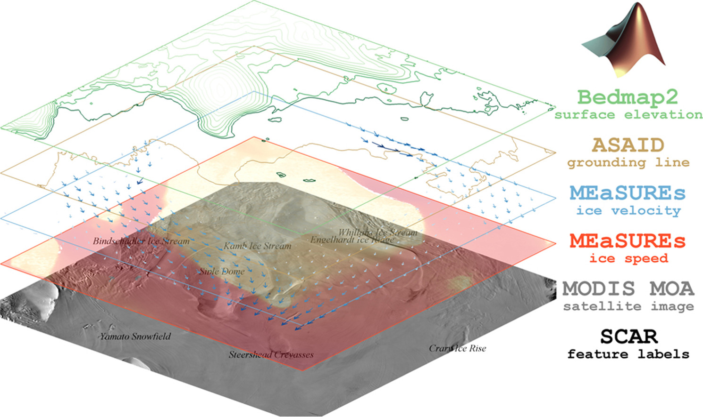

# Antarctic Mapping Tools for MATLAB

Functions for analyzing and mapping Antarctic geospatial datasets.

View documentation online by clicking on the Examples tab in the [AMT File Exchange page](https://www.mathworks.com/matlabcentral/fileexchange/47638). 

# Getting Started 
If you install this toolbox directly through the Add-Ons menu in MATLAB, that should be the only step needed for installation. If, however, you're manually downloading the files, then be sure to add the AMT folder to your file path so MATLAB will know to find it. 

After installing AMT, type 

    showdemo AMT_getting_started

and that'll walk you through some basic things you can do with AMT. 

If you need help with a particular function, just type `amt` followed by the function name For example, to see documentation for the `ll2ps` function, type 

    amt ll2ps
    
Not sure the name of the function or dataset you're looking for? Type 

    amt 

and that will bring up a list of available functions and datasets.  

# Recommended Plug-ins
This GitHub repository contains a basic set of tools that should be useful for analyzing or mapping any Antarctic dataset, but in many cases you'll also want to use publicly available datasets that aren't directly included in the base AMT package. At present, I've written functions designed specifically for more than 40 datasets, and you can find them on [my File Exchange page](https://www.mathworks.com/matlabcentral/fileexchange/?q=profileid:1062128), or you can get a list with short descriptions by typing `amt` into the Command Window.

A few AMT Plug-ins that I think are particularly useful across disciplines are 

- [Antarctic Boundaries, grounding line, and masks](https://www.mathworks.com/matlabcentral/fileexchange/60246) from Mouginot et al. This tidy little toolbox includes functions like `isgrounded` or `isiceshelf`, which I use nearly every single day. 
- [BedMachine](https://github.com/chadagreene/BedMachine) ice sheet geometry by Morlighem et al. The data is gorgeous and the functions are pretty well written. 
- [MODIS Mosaic of Antarctica](https://github.com/chadagreene/MODIS-MOA) provides a wonderful basemap for almost any application. 
- [ITS_LIVE surface velocity mosaics](https://github.com/chadagreene/ITS_LIVE) Currently available in the form of annual mosaics or an overall composite dataset, these mosaics span 1985 to present. 
- Want more datasets? [Here you'll find tools for 40+ Antarctic datasets on MATLAB File Exchange](https://www.mathworks.com/matlabcentral/fileexchange/?q=profileid:1062128).

# No More Mapping Toolbox Dependency
MATLAB offers a Mapping Toolbox of its own, which contains some very useful functions, but in general I find that MATLAB's Mapping Toolbox is expensive and not very user friendly. It's also much less computationally efficient than plotting in plain x,y coordinates. In the early years of AMT, most of the AMT functions were designed to create maps using MATLAB'S Mapping Toolbox. However, in recent years I have fully shifted toward plotting in simple projected (x and y in meters) coordinates, which tends to plot much faster and doesn't require any paid toolboxes. Use functions like `plotps()` to plot without Matlab's Mapping Toolbox. 

# Arctic version 
For a mostly Greenland centric version of this toolbox go [here](https://github.com/chadagreene/arctic-mapping-tools). 

# Citing Antarctic Mapping Tools 
If these functions are useful for you, please cite our paper as follows: 

Greene, C. A., Gwyther, D. E., & Blankenship, D. D. (2017). Antarctic Mapping Tools for Matlab. Computers & Geosciences, 104, 151–157. Elsevier BV. [https://doi.org/10.1016/j.cageo.2016.08.003](https://doi.org/10.1016/j.cageo.2016.08.003)

or in BibTeX if you prefer: 

	@article{greene2017antarctic,
	  title={{Antarctic Mapping Tools for MATLAB}},
	  author={Greene, Chad A and Gwyther, David E and Blankenship, Donald D},
	  journal={Computers \& Geosciences},
	  volume={104},
	  pages={151--157},
	  year={2017},
	  publisher={Elsevier}, 
	  doi={10.1016/j.cageo.2016.08.003}
	}
